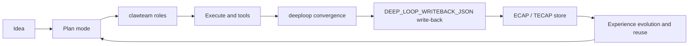
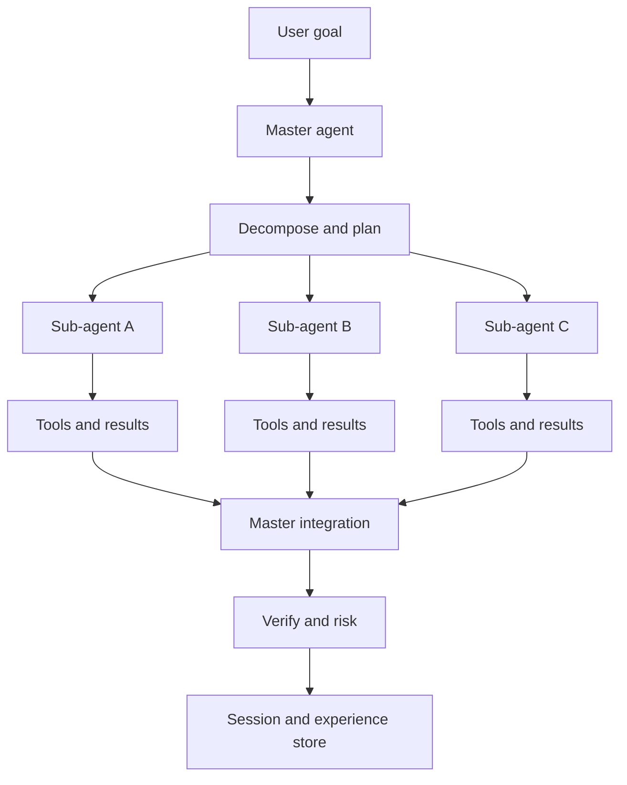

# ClawCode

**Creative dev tool / AI engineering Swiss Army knife (terminal-native)**  

Turn **idea → memory → plan → code → verify → review → learned experience** into one executable, learnable, evolving engineering loop.


**English (this page)** · [简体中文](README.zh.md)

---

## Table of contents

- [What is ClawCode?](#what-is-clawcode)
- [Product vision](#product-vision)
- [Value at a glance](#value-at-a-glance)
- [Who it’s for / Get started](#whos-it-for--get-started)
- [Capability matrix (definition–problem–value–entry)](#capability-matrix-definitionproblemvalueentry)
- [Full-stack development loop (diagram)](#full-stack-development-loop-diagram)
- [Master–slave agent architecture (diagram)](#masterslave-agent-architecture-diagram)
- [How ClawCode compares](#how-clawcode-compares)
- [Alignment with Claude Code (workflow migration)](#alignment-with-claude-code-workflow-migration)
- [Pro development: slash commands & skills](#pro-development-slash-commands--skills)
- [Quick start](#quick-start)
- [Configuration & capability switches](#configuration--capability-switches)
- [Tiered onboarding](#tiered-onboarding)
- [High-value scenarios](#high-value-scenarios)
- [Documentation index](#documentation-index)
- [What’s New](#whats-new)
- [Roadmap](#roadmap)
- [Contributing](#contributing)
- [Security](#security)
- [License](#license)

---

## What is ClawCode?

If you think of an AI coding assistant as “a chat box that writes code,” ClawCode is not in that category.  
ClawCode is positioned as a **creative dev tool + engineering execution system**.

- For individuals: a durable terminal partner that doesn’t only answer “how,” but helps you **finish and verify**.
- For teams: a governable intelligent workspace with role splits, policy configuration, session continuity, and experience write-back.

Think of it as an AI engineering Swiss Army knife: immediate execution **and** long-term learning and self-improvement.

---

## Product vision

ClawCode is not “yet another chat assistant”; it is a creative dev tool aimed at real delivery. Core motivations:

- **Turn ideas into runnable code quickly**  
  From “I have an idea” to “implemented and verified,” with less context switching and tool friction.

- **Stay vendor- and model-agnostic**  
  Configurable providers/models and open extension paths reduce lock-in.

- **Reuse strong UX patterns instead of reinventing habits**  
  Learn from mature tools (e.g. Claude Code, Cursor) and preserve familiar workflows where possible.

- **Remember usage and improve over time**  
  Session persistence, experience write-back, and closed-loop learning let the system evolve with tasks and team practice.

- **Execute “full-stack” engineering tasks end-to-end**  
  Beyond one-off codegen: planning, delegation, execution, verification, review, and structured learning.

### Full-stack task execution stack (Claw framework + tools + computer use)

“Full-stack” tasks are not a single codegen step—they chain **planning, coding, verification, review, environment actions, and learning** into one executable path. ClawCode implements three layers:

| Layer | Role | Key components / commands | Typical tasks | Entry points |
|---|---|---|---|---|
| Claw framework (agent runtime) | In Claw mode, `ClawAgent` runs multi-step work aligned with the main agent loop, with iteration budget and sub-agent coordination | `/claw`, `ClawAgent.run_claw_turn`, `run_agent` / `run_conversation` | Phased complex tasks, cross-turn context, bounded multi-round execution | `docs/CLAW_MODE.md`, `clawcode/llm/claw.py` |
| Tool orchestration (engineering execution) | Slash commands and tools drive plan-to-delivery flows: collaboration, review, diagnostics, learning | `/clawteam`, `/architect`, `/tdd`, `/code-review`, `/orchestrate`, `/multi-*` | Decompose requirements, implement, test, review, converge and write back | `clawcode/tui/builtin_slash.py`, `docs/CLAWTEAM_SLASH_GUIDE.md` |
| Computer use (OS-level) | With `desktop.enabled`, `desktop_*` tools provide screenshots, mouse, and keyboard automation; complements `browser_*` | `desktop_screenshot`, `desktop_click`, `desktop_type`, `desktop_key`, `/doctor` | Cross-app actions, desktop checks, GUI-assisted verification | `docs/DESKTOP_TOOLS.md`, `docs/CLAW_MODE.md` (Desktop tools) |

> `desktop_*` is **off by default**. Enable explicitly and install optional extras (e.g. `pip install -e ".[desktop]"` or equivalent). Prefer least privilege and a controlled environment.

That is why ClawCode combines **terminal execution + team orchestration + experience evolution** in one framework: a long-lived engineering partner—not a short Q&A toy.

---

## Value at a glance

| Dimension | Core capability | User value |
|---|---|---|
| Idea to delivery | Terminal-native execution + ReAct tool orchestration | Less switching; ideas become runnable results faster |
| Long-horizon work | Local persistent sessions + master–slave agents + decomposition | Multi-round complex tasks with handoff and review |
| Learning loop | deeploop + Experience + ECAP/TECAP | Not one-shot success—the system grows with your team |

---

## Who it’s for / Get started

### Who it’s for

- Developers who live in the terminal and want AI to **execute**, not only suggest.
- Teams that need multi-role collaboration, governable flows, and reviewable outputs.
- Leads who care about **long-term outcomes**, not a single answer.

### Get started

```bash
cd clawcode
python -m venv .venv
.\.venv\Scripts\Activate.ps1
pip install -e ".[dev]"
clawcode
```

---

## Project highlights — beyond “just writing code”

### 1) Long-horizon projects: durable memory + continuous context

Sessions and messages persist locally—not a throwaway chat. Split complex work across rounds, keep decisions and history, and support handoff and postmortems.

**Why it matters:** Fits real long-cycle development, not one-off demos.

### 2) `clawteam`: a schedulable virtual R&D team

With `/clawteam`, the system can orchestrate roles and execution:

- Intelligent role pick and assignment
- Serial/parallel flow planning
- Per-role outputs and final integration
- **10+** professional roles (product, architecture, backend, frontend, QA, SRE, …)

#### `clawteam` roles (overview)

| Role ID | Role | Responsibility & typical outputs |
| --- | --- | --- |
| `clawteam-product-manager` | Product manager | Priorities, roadmap, value hypotheses; scope and acceptance criteria |
| `clawteam-business-analyst` | Business analyst | Process and rules; requirements, edge cases, business acceptance |
| `clawteam-system-architect` | System architect | Architecture and tech choices; modules, APIs, NFRs (performance, security, …) |
| `clawteam-ui-ux-designer` | UI/UX | IA and interaction; page/component UX constraints |
| `clawteam-dev-manager` | Engineering manager | Rhythm and dependencies; risks, staffing, milestones |
| `clawteam-team-lead` | Tech lead | Technical decisions and quality bar; split of work, review, integration |
| `clawteam-rnd-backend` | Backend | Services, APIs, data layer; contracts and implementation |
| `clawteam-rnd-frontend` | Frontend | UI and front-end engineering; components, state, integration |
| `clawteam-rnd-mobile` | Mobile | Mobile/cross-platform; release constraints |
| `clawteam-devops` | DevOps | CI/CD and release; pipelines, artifacts, environments |
| `clawteam-qa` | QA | Test strategy and gates; cases, regression scope, severity |
| `clawteam-sre` | SRE | Availability, capacity, observability; SLOs, alerts, runbooks |
| `clawteam-project-manager` | Project manager | Scope, schedule, stakeholders; milestones and change control |
| `clawteam-scrum-master` | Scrum Master | Iteration rhythm and blockers; ceremony and collaboration norms |

Short aliases (e.g. `qa`, `sre`, `product-manager`) map to the `clawteam-*` roles above—see `docs/CLAWTEAM_SLASH_GUIDE.md`.
**Why it matters:** Moves from “one model, one thread” to **multi-role collaborative problem solving**.


### 3) `clawteam` deeploop: convergent closed-loop iteration

`/clawteam --deep_loop` runs multiple converging rounds—not “one pass and done.”


- Structured contract per round (goals, handoffs, gaps, …)
- Parse `DEEP_LOOP_WRITEBACK_JSON` and write back automatically when configured
- Tunable convergence thresholds, max iterations, rollback, consistency

**Why it matters:** Turns “feels done” into **metric-driven convergence**.

### 4) Closed-loop learning: Experience / ECAP / TECAP

ClawCode treats **experience** as a first-class artifact—not only conclusions, but **portable structure**:

- **Experience:** an experience function between goals and outcomes; **gap** drives improvement.
- **ECAP** (Experience Capsule): individual/task-level capsules.
- **TECAP** (Team Experience Capsule): team collaboration capsules.
- **instinct–experience–skill:** reusable path from rules and experience to skills.

#### Implementation mapping (concept to code)

| Object | Implementation | Commands / surfaces | Storage | Docs |
|---|---|---|---|---|
| Experience signals | Distill reusable signals from execution traces | `/learn`, `/learn-orchestrate`, `/instinct-status` | Observations under local data directory | `docs/ECAP_v2_USER_GUIDE.md` |
| ECAP | `ecap-v2` schema: `solution_trace.steps`, `tool_sequence`, `outcome`, `transfer`, `governance`, … | `/experience-create`, `/experience-apply`, `/experience-feedback`, `/experience-export`, `/experience-import` | `<data>/learning/experience/capsules/`, `exports/`, `feedback.jsonl` | `docs/ECAP_v2_USER_GUIDE.md` |
| TECAP | `tecap-v1` → `tecap-v2` upgrade; fields like `team_topology`, `coordination_metrics`, `quality_gates`, `match_explain` | `/team-experience-create`, `/team-experience-apply`, `/team-experience-export`, `/tecap-*` | On-disk capsules + JSON/Markdown export (`--v1-compatible` optional) | `docs/TECAP_v2_UPGRADE.md` |
| Deeploop write-back | Structured rounds + `DEEP_LOOP_WRITEBACK_JSON` + finalize | `/clawteam --deep_loop`, `/clawteam-deeploop-finalize` | Pending session metadata + `LearningService` path | `docs/CLAWTEAM_SLASH_GUIDE.md` |
| Governance & migration | Privacy tiers, redaction, feedback scores, compatibility | `--privacy`, `--v1-compatible`, `--strategy`, `--explain` | Audit snapshots; export wrappers (`schema_meta`, `quality_score`, …) | `docs/ECAP_v2_USER_GUIDE.md`, `docs/TECAP_v2_UPGRADE.md` |

#### Closed-loop evolution (implementation view)

```mermaid
flowchart LR
  taskExec[Task execution and tool observations] --> expSignal[Experience signal extraction]
  expSignal --> ecapCreate[ECAP create and structured store]
  ecapCreate --> ecapApply[ECAP retrieve and apply before new work]
  ecapApply --> taskOutcome[Outcome and verification]
  taskOutcome --> feedback[experience_feedback scores]
  feedback --> evolveSkill[instinct_experience_skill evolution]
  evolveSkill --> teamCollab[clawteam collaboration]
  teamCollab --> tecapCreate[TECAP create or upgrade to tecap_v2]
  tecapCreate --> teamApply[team_experience_apply context injection]
  teamApply --> loopGate[deep_loop convergence and write-back]
  loopGate --> expSignal
```



**Why it matters:** The system doesn’t only “do it once”—it **improves the next run** from feedback.

### 5) Code Awareness: coding perception and trace visibility

In the TUI, Code Awareness helps with:

- Read/write path awareness and behavioral traces
- Clearer context around the working set and file relationships
- Layering and impact scope

**Why it matters:** Makes **what the AI is doing** visible and governable—not a black box.

### 6) Master–slave agents + Plan / Execute

- Master agent: strategy and control
- Sub-agents / tasks: decomposition and execution
- Plan-then-execute for stable progress

**Why it matters:** Converge on a plan first, then land changes with less churn.

### 7) Ecosystem alignment (migration-friendly) + extensions

- Aligns with Claude Code / Codex / OpenCode workflow semantics (complementary positioning)
- Reusable **plugin** and **skill** systems
- **MCP** integration
- Optional **computer use / desktop** (policy- and permission-gated)

**Why it matters:** Lower migration cost first, then amplify unique capabilities; stay open to your existing toolchain.

---

## Capability matrix (definition–problem–value–entry)

| Dimension | Definition | Problem solved | User value | Where to look |
|---|---|---|---|---|
| Personal velocity | Terminal-native loop (TUI + CLI + tools) | Chat vs real execution drift | Analyze, change, verify in one surface | `README.md`, `pyproject.toml`, `clawcode -p` |
| Team orchestration | `clawteam` roles (parallel/serial) | One model can’t cover every function | Integrated multi-role output | `docs/CLAWTEAM_SLASH_GUIDE.md` |
| Long-term evolution | `deeploop` + automatic write-back | Lessons lost when the task ends | Reusable structured experience | `docs/CLAWTEAM_SLASH_GUIDE.md` (deep_loop / write-back) |
| Learning loop | Experience / ECAP / TECAP | Hard to migrate or audit “tribal knowledge” | Structured, portable, feedback-ready | `docs/ECAP_v2_USER_GUIDE.md`, `docs/TECAP_v2_UPGRADE.md` |
| Observability | Code Awareness | Opaque tool paths | Clearer read/write traces and impact | `docs/技术架构详细说明.md`, TUI modules |
| Extensibility | plugin / skill / MCP / computer use | Closed toolchain | Fit existing ecosystem and grow by scenario | `docs/plugins.md`, `CLAW_MODE.md`, `pyproject.toml` extras |

---

## Full-stack development loop (diagram)



---

## Master–slave agent architecture (diagram)



---

## How ClawCode compares

| Dimension | Typical IDE chat | Typical API-only scripts | ClawCode |
|---|---|---|---|
| Primary surface | IDE panel | Custom scripts | **Terminal-native TUI + CLI** |
| Execution depth | Often suggestion-first | Deep but DIY | **Built-in tool execution loop** |
| Long-horizon continuity | Varies | Custom state | **Local persistence + write-back** |
| Team orchestration | Weak / none | Build yourself | **`clawteam` roles and scheduling** |
| Learning loop | Weak / none | Expensive to build | **ECAP/TECAP + deep loop** |
| Observability & governance | Varies | DIY | **Config-driven, permission-aware, audit-friendly** |
| Ecosystem | Vendor-bound | Flexible but heavy | **plugin / skill / MCP / computer-use paths** |

> **Scope note:** Capability and architecture comparison only—no “X% faster” claims; based on documented, verifiable behavior.

---

## Alignment with Claude Code (workflow migration)

To lower learning and migration cost, ClawCode offers **alignable** workflows where it matters.


- If you want **polished product UX out of the box**, Claude Code has strengths.
- If you want **deep terminal execution + team orchestration + learning loops + configurable extensions**, ClawCode emphasizes that combination.

ClawCode is not trying to replace every tool. It uses **alignment as a migration layer** and **closed-loop engineering evolution** as the core value layer.

| Alignment | What it means | Extra value in ClawCode |
|---|---|---|
| Slash workflows | Organize work with `/` commands (e.g. `/clawteam`, `/clawteam --deep_loop`) | Goes from “command fired” to **multi-role orchestration + convergence + write-back** |
| Skills | Reuse and extend skills; lower asset migration cost | Skills can plug into **experience loops** and improve per project |
| Terminal-native | TUI/CLI habits and scripting | Analyze, execute, verify, and review **in one surface** |
| Extensible tools | plugin / MCP / computer use | Progressive capability expansion under team policy |

---

## Pro development: slash commands & skills

Beyond migration-friendly defaults, ClawCode ships **built-in pro workflows**: common multi-step flows as `/slash` commands, with **skills** to encode team practice.

### 1) Built-in `/slash` commands (engineering workflows)

| Cluster | Examples | Typical use |
|---|---|---|
| Multi-role & convergence | `/clawteam`, `/clawteam --deep_loop`, `/clawteam-deeploop-finalize` | Roles, converging iterations, structured write-back |
| Architecture & quality gates | `/architect`, `/code-review`, `/security-review`, `/review` | Design/review, ranked findings, security pass |
| Execution orchestration | `/orchestrate`, `/multi-plan`, `/multi-execute`, `/multi-workflow` | Phased plan → execute → deliver |
| Test-driven dev | `/tdd` | RED → GREEN → Refactor with gates |
| ECAP learning | `/learn`, `/learn-orchestrate`, `/experience-create`, `/experience-apply` | Distill experience and feed the next task |
| TECAP team learning | `/team-experience-create`, `/team-experience-apply`, `/tecap-*` | Team-level capsules, migration, reuse |
| Observability & diagnostics | `/experience-dashboard`, `/closed-loop-contract`, `/instinct-status`, `/doctor`, `/diff` | Metrics, config contract checks, environment and diff diagnostics |

> Full list: `clawcode/tui/builtin_slash.py`. Deep dives: `docs/CLAWTEAM_SLASH_GUIDE.md`, `docs/ARCHITECT_SLASH_GUIDE.md`, `docs/MULTI_PLAN_SLASH_GUIDE.md`.

### 2) Bundled skills (reusable expertise)

| Category | Examples | Delivery value |
|---|---|---|
| Backend & API | `backend-patterns`, `api-design`, `django-patterns`, `springboot-patterns` | Consistent API and backend design; less rework |
| Frontend | `frontend-patterns` | Shared UI implementation patterns |
| Languages | `python-patterns`, `golang-patterns` | Idiomatic reusable patterns per stack |
| Data & migrations | `database-migrations`, `clickhouse-io` | Safer schema/data changes; verify rollback |
| Shipping | `docker-patterns`, `deployment-patterns`, `coding-standards` | Build, release, and quality bars |
| Cross-tool | `codex`, `opencode` | Easier multi-tool workflows |
| Planning | `strategic-compact` | Dense, actionable plans for complex work |

> Paths: `clawcode/plugin/builtin_plugins/clawcode-skills/skills/`.  
> Suggested flow: frame execution with `/clawteam` or `/multi-plan`, then layer domain skills for consistency.

---

## Quick start

### Requirements

- Python `>=3.12`
- At least one configured model provider credential

### Install (source / dev)

```bash
cd clawcode
python -m venv .venv
# Windows PowerShell
.\.venv\Scripts\Activate.ps1
pip install -e ".[dev]"
```

### Run

```bash
clawcode
# or
python -m clawcode
```

### Prompt mode

```bash
clawcode -p "Summarize this repository’s architecture in five bullets."
```

### JSON output mode

```bash
clawcode -p "Summarize recent changes" -f json
```

---

## Configuration & capability switches

ClawCode is configuration-driven. Main entry points:

- `pyproject.toml` (metadata and dependencies)
- `clawcode/config/settings.py` (runtime settings model)

Typical knobs:

- Provider / model selection
- `/clawteam --deep_loop` convergence parameters
- Experience / ECAP / TECAP behavior
- Desktop / computer-use and other optional features

---

## Tiered onboarding

### ~5 minutes (run it)

1. Install and start `clawcode`  
2. Run `clawcode -p "..."` once  
3. In the TUI, try `/clawteam <your ask>`

### ~30 minutes (close the loop)

1. Pick a small real task (fix / refactor / tests)  
2. Run `/clawteam --deep_loop` for 2–3 rounds  
3. Inspect `DEEP_LOOP_WRITEBACK_JSON` and write-back results

### Team rollout (repeatable)

1. Align model and policy (provider/model)  
2. Inventory reusable skills/plugins and minimal conventions  
3. Wire feedback into ECAP/TECAP

---

## High-value scenarios

- Greenfield complexity: plan first, execute across converging rounds  
- Legacy modernization: multi-role risk ordering and sequencing  
- Handoffs: sessions and experience that can be reviewed and migrated  
- Long-running work: iterate without losing thread  
- Automation: CLI and scriptable batches

---

## Documentation index

| Topic | Path |
|------|------|
| `/clawteam` & `deep_loop` | `docs/CLAWTEAM_SLASH_GUIDE.md` |
| ECAP v2 | `docs/ECAP_v2_USER_GUIDE.md` |
| TECAP v1→v2 | `docs/TECAP_v2_UPGRADE.md` |
| Architecture (layers & modules) | `docs/技术架构详细说明.md` |
| Project overview | `docs/项目详细介绍.md` |
| Optional dependencies / extras | `pyproject.toml` (`optional-dependencies`) |
| Docs index (Chinese) | `docs/README.zh.md` |

---

## What’s New

- `clawteam --deep_loop` automatic write-back path and manual `/clawteam-deeploop-finalize` fallback  
- Convergence-related settings such as `clawteam_deeploop_consistency_min`  
- Deeploop event aggregation and test coverage improvements  
- Documentation for `clawteam_deeploop_*` and closed-loop behavior  

---

## Roadmap

- Richer Code Awareness (read/write traces mapped to architecture layers)  
- Team-level experience dashboards (aggregated metrics)  
- Slash workflow templates (task type → flow template)  
- Stronger computer-use safety policies and extension hooks  

---

## Contributing

Contributions welcome. Before opening a PR:

```bash
pytest
ruff check .
mypy .
```

For larger design changes, open an issue first to align scope and goals.

---

## Security

AI tooling may run commands and modify files. Use ClawCode in a controlled environment, review outputs, and apply least privilege to credentials and capability switches.

---

## License

GPL-3.0 license.
