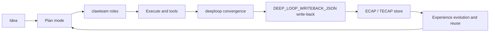

<p align="center">
 
</p>

<h1 align="center">ClawCode</h1>

<p align="center">
  <strong>Your creative dev tool , AI coding Swiss Army knife</strong>
</p>

<p align="center">
  <a href="https://github.com/deepelementlab/clawcode/releases">
   
  </a>
  <a href="#license"></a>
  <a href="https://github.com/deepelementlab/clawcode/wiki"></a>
  <a href="https://gitcgr.com/deepelementlab/clawcode">
    
  </a>
</p>

<p align="center">
  <a href="README.md">English</a> |
  <a href="README.zh.md">简体中文</a> 
</p>

<p align="center">
  <a href="#philosophy">Philosophy</a> •
  <a href="#product-vision">Product vision</a> •
  <a href="#development-assistance-functions">Development assistance functions</a> •
  <a href="#system-architecture">System Architecture</a> •
  <a href="#value-at-a-glance">Value at a glance</a> •
  <a href="#get-started">Get started</a>
</p>


ClawCode is a Claude Code‑inspired implementation in Python and Rust, focused on agents and experience‑based evolution. It is also an open‑source coding‑agent CLI for Anthropic, OpenAI, Gemini, DeepSeek, GLM, Kimi, Ollama, Codex, GitHub Models, and 200+ models via OpenAI‑compatible APIs.


## Portfolio
[`MonsterLand`](https://github.com/deepelementlab/MonsterLand): Creative games and tooling apps built with clawcode.

## Philosophy

We aim to build an open, excellent AI coding Swiss Army knife.

It starts with a coder agent framework (tool use, skills, memory, multi‑agent). On this we built Claw, adding more tools, OpenClaw skill compatibility, and computer‑use abilities.

But that's not enough. Our own projects generate valuable development data through iterations. We shouldn't waste them.

So we built a self‑improving subsystem: it uses that data to continuously enhance the agents. All data stays local, under your control. The system is open source, auditable, with no hidden telemetry.

In short: an experience‑based reinforcement learning framework that turns

Idea → Memory → Plan → Code → Verify → Review → Learned Experience

into an executable, learnable, evolving engineering loop.


---

## Product vision

ClawCode is a creative dev tool aimed at real delivery. 

### Features:


### Core motivations:

- **Turn ideas into runnable code quickly**  
  From “I have an idea” to “implemented and verified,” with less context switching and tool friction.

- **Stay vendor- and model-agnostic**  
  Configurable providers/models and open extension paths reduce lock-in.

- **Reuse strong UX patterns instead of reinventing habits**  
  Learn from mature tools (e.g. Claude Code, Cursor) and preserve familiar workflows where possible.

- **Remember usage and improve over time**  
  Session persistence, experience write-back, and closed-loop learning let the system evolve with tasks and team practice.

- **Execute “full-stack” engineering tasks end-to-end**  
  Beyond one-off codegen: planning, delegation, execution, verification, review, and structured learning.

## Design
Enable the model to gain a deeper understanding of product design aesthetics.


The demo and baseline now adopt the Google Stitch open-source standard. And The demo provides 55 open-source real-world brand case studies. The coder workflow extensively references them during UI design and coding; you are also free to use them selectively.

| Path | Purpose |
|------|---------|
| [`UI/`](./.claw/design/UI/) | Curated **product / brand UI references** — each brand folder includes `DESIGN.md`, previews, and notes. See **[`UI/README.md`](./.claw/design/UI/README.md)** for the full catalog and links. |


## Development assistance functions

### Architecture & review

| Command | Function |
|--------|----------|
| `/architect` | Run architecture design/review workflow with trade-off analysis and ADR/checklist options. |
| `/code-review` | Review local uncommitted changes with severity-ranked findings and commit gate. |
| `/security-review` | Complete a security review of the pending changes on the current branch. |
| `/review` | Review a pull request. |

### Autocomplete / related planning & plugins

| Command | Function |
|--------|----------|
| `/plan` | Enable plan mode or view the current session plan (handled in ChatScreen; listed for autocomplete). |
| `/arc-plan` | Generate a one-shot alternative implementation plan (ARC planner). |
| `/plugin` | Manage clawcode plugins. |

### Test-driven development

| Command | Function |
|--------|----------|
| `/tdd` | Run strict TDD workflow: scaffold, RED, GREEN, refactor, and coverage gate. |

### Multi-role orchestration & engineering workflows

| Command | Function |
|--------|----------|
| `/clawteam` | Run multi-role task orchestration, or target one role via `/clawteam:<agent>`. Supports `--deep_loop` for iterative convergence (see `docs/CLAWTEAM_SLASH_GUIDE.md`). |
| `/clawteam-deeploop-finalize` | Parse `DEEP_LOOP_WRITEBACK_JSON` from pasted or last assistant text using pending deep-loop session metadata. |
| `/multi-plan` | Run multi-model collaborative planning workflow (plan-only). |
| `/multi-execute` | Run multi-model collaborative execution workflow with traceable artifacts. |
| `/multi-backend` | Run backend-focused multi-model workflow (research through review, orchestrator writes code). |
| `/multi-frontend` | Run frontend-focused multi-model workflow (UI/UX led, orchestrator writes code). |
| `/multi-workflow` | Run full-stack multi-model workflow (backend + UI advisors, orchestrator writes code). |
| `/orchestrate` | Run sequential multi-role workflow (HANDOFF between planner/TDD/review/security/architect); `/orchestrate show\|list`. |


### Learning loop: ECAP, TECAP & instincts

| Command | Function |
|--------|----------|
| `/learn` | Learn reusable instincts from recent tool observations. |
| `/learn-orchestrate` | Run observe → evolve → import-to-skill-store orchestration in one command. |
| `/experience-create` | Create an ECAP experience capsule from recent observations/instincts. |
| `/experience-status` | List available ECAP capsules with optional filters. |
| `/experience-export` | Export an ECAP capsule as JSON/Markdown for model or human use. |
| `/experience-import` | Import an ECAP capsule from local file or URL. |
| `/experience-apply` | Apply an ECAP capsule as one-shot agent prompt context. |
| `/experience-feedback` | Record success/failure feedback score for an ECAP capsule. |
| `/team-experience-create` | Create a TECAP team-experience capsule from collaborative traces. |
| `/team-experience-status` | List TECAP capsules with optional team/problem filters. |
| `/team-experience-export` | Export a TECAP capsule as JSON/Markdown for agents and humans. |
| `/team-experience-import` | Import a TECAP capsule from local file or URL. |
| `/team-experience-apply` | Apply a TECAP capsule as collaboration context prompt. |
| `/team-experience-feedback` | Record feedback score for a TECAP capsule. |
| `/tecap-create` | Alias of `/team-experience-create`. |
| `/tecap-status` | Alias of `/team-experience-status`. |
| `/tecap-export` | Alias of `/team-experience-export`. |
| `/tecap-import` | Alias of `/team-experience-import`. |
| `/tecap-apply` | Alias of `/team-experience-apply`. |
| `/tecap-feedback` | Alias of `/team-experience-feedback`. |
| `/instinct-status` | Show learned instincts grouped by domain and confidence. |
| `/instinct-import` | Import instincts from local file or URL into inherited set. |
| `/instinct-export` | Export instincts with optional domain/confidence filters. |
| `/evolve` | Cluster instincts and optionally generate evolved structures. |
| `/experience-dashboard` | Show ECAP-first experience metrics dashboard (add `--json` or `--no-alerts`). |
| `/closed-loop-contract` | Show closed-loop config contract coverage (consumed vs unconsumed keys). |

### Observability, diagnostics & diffs

| Command | Function |
|--------|----------|
| `/doctor` | Diagnose and verify your clawcode installation and settings. |
| `/diff` | View uncommitted changes and per-turn diffs. |
| `/debug` | Debug your current clawcode session via logs (bundled viewer). |
| `/insights` | Generate a report analyzing your clawcode sessions. |

### Claw mode & external CLIs

| Command | Function |
|--------|----------|
| `/claw` | Enable Claw agent mode or show status (autocomplete entry; see `SLASH_AUTOCOMPLETE_EXTRA` in `builtin_slash.py`). |
| `/claude` | Enable Claw mode then path A: Anthropic + Claude Code HTTP identity. |
| `/claude-cli` | Enable Claw mode then path B: run claude / claude-code CLI in workspace. |
| `/opencode-cli` | Enable Claw mode then path B′: run OpenCode opencode CLI in workspace. |
| `/codex-cli` | Enable Claw mode then path B″: run OpenAI Codex CLI in workspace. |

### Session, Git, workspace & engineering context

| Command | Function |
|--------|----------|
| `/checkpoint` | Git workflow checkpoints: `create`, `verify`, `list`, `clear`. |
| `/rewind` | Soft-archive chat after a message, or inspect/restore tracked git files. |
| `/tasks` | List and manage background tasks (plan build, agent run). |
| `/init` | Initialize CLAWCODE.md (or CLAW.md-style) codebase documentation in the project. |
| `/add-dir` | Add a new working directory. |
| `/agents` | Manage agent configurations. |
| `/skills` | List available skills. |
| `/mcp` | Manage MCP servers. |
| `/hooks` | Manage hook configurations for tool events. |
| `/permissions` | Manage allow & deny tool permission rules. |
| `/memory` | Edit claw memory files. |
| `/pr-comments` | Get comments from a GitHub pull request. |

## System Architecture


## Compatible with Claude Code (config & plugins & skills)

To lower learning and migration cost, ClawCode offers **alignable** workflows where it matters.


- If you want **polished product UX out of the box**, Claude Code has strengths.
- If you want **deep terminal execution + team orchestration + learning loops + configurable extensions**, ClawCode emphasizes that combination.

ClawCode uses **alignment as a migration layer** and **closed-loop engineering evolution** as the core value layer.

| Alignment | What it means | Extra value in ClawCode |
|---|---|---|
| Slash workflows | Organize work with `/` commands (e.g. `/clawteam`, `/clawteam --deep_loop`) | Goes from “command fired” to **multi-role orchestration + convergence + write-back** |
| Skills | Reuse and extend skills; lower asset migration cost | Skills can plug into **experience loops** and improve per project |
| Terminal-native | TUI/CLI habits and scripting | Analyze, execute, verify, and review **in one surface** |
| Extensible tools | plugin / MCP / computer use | Progressive capability expansion under team policy |

## Compatible with Claude Code (Agent & Subagent)


## Agent roles & team (Claude Code–style)

ClawCode aligns with Claude Code’s **Agent** tool: the main agent spawns **subagents** with isolated context, custom prompts, and tool allowlists. Subagents **cannot** nest another `Agent` / `Task` (delegation is stripped for the inner run).

### 1. Built-in subagent roles

| Agent id | Purpose (short) |
| --- | --- |
| `explore` | Read-only exploration (`Read`/`Glob`/`Grep`/…) |
| `plan` | Read-only research for planning |
| `code-review` | Review-focused, read-only tools |
| `general-purpose` | Full tool surface (minus delegate tools) when you omit a custom list |

### 2. Built-in **clawteam** (multi-role “team”)

Use these ids as `agent` / `subagent_type` the same way as `explore` / `plan`. Examples: `clawteam-system-architect`, `clawteam-rnd-backend`, `clawteam-qa`, `clawteam-product-manager`, … (all `clawteam-*` ids ship in the built-in registry).

**Collaboration model:** the **orchestrator** is still the main agent—it calls `Agent` multiple times with different role ids and tasks. There is no separate “team scheduler” UI; “team work” is **sequential/parallel tool calls** decided by the model.

### 3. Custom roles (project + user)

Definitions are **Markdown files** with **YAML frontmatter** (same idea as `.claude/agents/`).

**User-wide (highest override of project defaults for same name):**

- `~/.claude/agents/*.md`

**Project (read merge order; later roots override earlier for the same `name`):**

- `.claw/agents/*.md`
- `.clawcode/agents/*.md`
- `.claude/agents/*.md`

Frontmatter fields (common):

| Field | Meaning |
| --- | --- |
| `name` | Agent id (default: filename stem) |
| `description` | Short blurb for routing / docs |
| `tools` | Optional allowlist using **Claude-style names** (`Read`, `Write`, `Bash`, …) — mapped to ClawCode tools |
| `disallowedTools` | Block list (same naming style) |
| `model` | Optional override (`inherit`, `sonnet`, `opus`, `haiku`, or full model id) |
| `maxTurns` | Cap on ReAct iterations for this subagent |
| `isolation` | e.g. `none`, `worktree`, `fork` |
| `permissionMode`, `background`, `mcpServers`, `hooks` | Passed through when set |

Body markdown becomes the subagent **system prompt**.

**Example** — `.claw/agents/api-guardian.md`:

```markdown
---
name: api-guardian
description: Reviews public HTTP API changes only.
tools:
  - Read
  - Glob
  - Grep
  - diagnostics
maxTurns: 24
---

You only analyze API routes and OpenAPI/contract files. Report breaking changes as a bullet list.
```

### 4. Invoking a subagent (`Agent` tool)

The model (or harness) calls **`Agent`** with at least a **task** and an **agent id**:

```json
{
  "agent": "plan",
  "task": "Map how authentication is implemented; list key files."
}
```

Aliases:

- `subagent_type` ↔ `agent`
- `prompt` ↔ `task`
- Optional: `context`, `timeout` (seconds), `max_iterations`, `isolation`, `allowed_tools` (override allowlist)

Unknown `agent` → error listing **known ids** from the merged registry (built-ins + your files).

### 5. Plan mode (`/plan`)

Only these subagents are allowed: `plan`, `explore`, `code-review` (plus internal `review` alias where applicable). Their tools are further restricted to **read-only** policy (no write/exec tools even if the definition asked for them).

### 6. Optional: deep-loop / handoff settings (`.clawcode.json`)

Runtime tuning for multi-round **clawteam-style** loops lives under settings such as `clawteam_deeploop_*` (enable flag, max iterations, convergence, handoff target, etc.). See project docs/snippets for a full example—this does **not** replace defining roles; it shapes how long/how strictly the loop runs.

### 7. Relation to `agents` in `.clawcode.json`

The top-level `agents` map (`coder`, `task`, `title`, `summarizer`, …) configures **which model/provider** backs **main** flows. **Subagent roles** (`explore`, `clawteam-*`, custom `*.md`) are selected by the **`Agent` tool** and merged from the paths above—not by renaming those slots.

---
### Full-stack task execution stack (AI Coding + Claw framework + tools + computer use)

“Full-stack” tasks are not a single codegen step—they chain **planning, coding, verification, review, environment actions, and learning** into one executable path. ClawCode implements three layers:

| Layer | Role | Key components / commands | Typical tasks |
|---|---|---|---|
| Coder agent (default terminal runtime)	| The default interactive path: Textual TUI wires sessions/messages, builds a coder runtime bundle from settings, and runs the main Agent loop (or ClawAgent.run_claw_turn when Claw mode is on). It owns send/finalize, HUD, plan state, and optional memory injection—without requiring /claw or workflow slash commands.|ChatScreen, _finalize_send_after_input, _start_agent_run, _process_message, build_coder_runtime, make_claw_agent / make_plain_agent, Agent.run, ClawAgent.run_claw_turn, _handle_agent_event, _rebuild_llm_stack|Everyday coding in the terminal: chat turns, file edits via tools, plan-style flows when /plan is active, model switch (e.g. Ctrl+O stack rebuild), non-Claw and Claw branches from the same screen|
| Claw framework (agent runtime) | In Claw mode, `ClawAgent` runs multi-step work aligned with the main agent loop, with iteration budget and sub-agent coordination | `/claw`, `ClawAgent.run_claw_turn`, `run_agent` / `run_conversation` | Phased complex tasks, cross-turn context, bounded multi-round execution |
| Tool orchestration (engineering execution) | Slash commands and tools drive plan-to-delivery flows: collaboration, review, diagnostics, learning | `/clawteam`, `/architect`, `/tdd`, `/code-review`, `/orchestrate`, `/multi-*` | Decompose requirements, implement, test, review, converge and write back |
| Computer use (OS-level) | With `desktop.enabled`, `desktop_*` tools provide screenshots, mouse, and keyboard automation; complements `browser_*` | `desktop_screenshot`, `desktop_click`, `desktop_type`, `desktop_key`, `/doctor` | Cross-app actions, desktop checks, GUI-assisted verification | 

> `desktop_*` is **off by default**. Enable explicitly and install optional extras (e.g. `pip install -e ".[desktop]"` or equivalent). Prefer least privilege and a controlled environment.

That is why ClawCode combines **terminal execution + team orchestration + experience evolution** in one framework: a long-lived engineering partner—not a short Q&A toy.

---

## Value at a glance

| Dimension | Core capability | User value |
|---|---|---|
| Idea to delivery | Terminal-native execution + ReAct tool orchestration | Less switching; ideas become runnable results faster |
| Long-horizon work | Local persistent sessions + master–slave agents + decomposition | Multi-round complex tasks with handoff and review |
| Learning loop | deeploop + Experience + ECAP/TECAP | Not one-shot success—the system grows with your team |

---

## Who it’s for / Get started

### Who it’s for

- Developers who live in the terminal and want AI to **execute**, not only suggest.
- Teams that need multi-role collaboration, governable flows, and reviewable outputs.
- Leads who care about **long-term outcomes**, not a single answer.

## Get started

```bash
cd clawcode
python -m venv .venv
.\.venv\Scripts\Activate.ps1
pip install -e ".[dev]"
python -m clawcode -c "[your project dir]"
```

---

## Project highlights — beyond “just writing code”

### 1) Long-horizon projects: durable memory + continuous context

Sessions and messages persist locally—not a throwaway chat. Split complex work across rounds, keep decisions and history, and support handoff and postmortems.

**Why it matters:** Fits real long-cycle development, not one-off demos.

### 2) `clawteam`: a schedulable virtual R&D team

With `/clawteam`, the system can orchestrate roles and execution:
- Professional role segmentation and extraction of mental models from years of industry experience.
- Intelligent role pick and assignment
- Serial/parallel flow planning
- Per-role outputs and final integration
- **10+** professional roles (product, architecture, backend, frontend, QA, SRE, …)

#### `clawteam` roles (overview)

| Role ID | Role | Responsibility & typical outputs |
| --- | --- | --- |
| [`clawteam-product-manager`](./.claw/agents/clawteam-product-manager.md) | Product manager | Priorities, roadmap, value hypotheses; scope and acceptance criteria |
| [`clawteam-business-analyst`](./.claw/agents/clawteam-business-analyst.md) | Business analyst | Process and rules; requirements, edge cases, business acceptance |
| [`clawteam-system-architect`](./.claw/agents/clawteam-system-architect.md) | System architect | Architecture and tech choices; modules, APIs, NFRs (performance, security, …) |
| [`clawteam-ui-ux-designer`](./.claw/agents/clawteam-ui-ux-designer.md) | UI/UX | IA and interaction; page/component UX constraints |
| [`clawteam-dev-manager`](./.claw/agents/clawteam-dev-manager.md) | Engineering manager | Rhythm and dependencies; risks, staffing, milestones |
| [`clawteam-team-lead`](./.claw/agents/clawteam-team-lead.md) | Tech lead | Technical decisions and quality bar; split of work, review, integration |
| [`clawteam-rnd-backend`](./.claw/agents/clawteam-rnd-backend.md) | Backend | Services, APIs, data layer; contracts and implementation |
| [`clawteam-rnd-frontend`](./.claw/agents/clawteam-rnd-frontend.md) | Frontend | UI and front-end engineering; components, state, integration |
| [`clawteam-rnd-mobile`](./.claw/agents/clawteam-rnd-mobile.md) | Mobile | Mobile/cross-platform; release constraints |
| [`clawteam-devops`](./.claw/agents/clawteam-devops.md) | DevOps | CI/CD and release; pipelines, artifacts, environments |
| [`clawteam-qa`](./.claw/agents/clawteam-qa.md) | QA | Test strategy and gates; cases, regression scope, severity |
| [`clawteam-sre`](./.claw/agents/clawteam-sre.md) | SRE | Availability, capacity, observability; SLOs, alerts, runbooks |
| [`clawteam-project-manager`](./.claw/agents/clawteam-project-manager.md) | Project manager | Scope, schedule, stakeholders; milestones and change control |
| [`clawteam-scrum-master`](./.claw/agents/clawteam-scrum-master.md) | Scrum Master | Iteration rhythm and blockers; ceremony and collaboration norms |

Short aliases (e.g. `qa`, `sre`, `product-manager`) map to the `clawteam-*` roles above—see `docs/CLAWTEAM_SLASH_GUIDE.md`.
**Why it matters:** Moves from “one model, one thread” to **multi-role collaborative problem solving**.


### 3) `clawteam` deeploop: convergent closed-loop iteration

Simulates the real‑world iterative development process of a project team, enabling deep collaborative development (this feature is still under improvement).

`/clawteam --deep_loop` runs multiple converging rounds—not “one pass and done.”


- Structured contract per round (goals, handoffs, gaps, …)
- Parse `DEEP_LOOP_WRITEBACK_JSON` and write back automatically when configured
- Tunable convergence thresholds, max iterations, rollback, consistency

**Why it matters:** Turns “feels done” into **metric-driven convergence**.

### 4) ECAP Closed-loop learning: 

ClawCode treats **experience** as a first-class artifact—not only conclusions, but **portable structure**:


- **Experience:** An experience function representing the gap between a goal and its outcome. It is a learnable function extracted from the process of resolving the goal–outcome gap, using that gap as the driver for improvement. The dimensional experience objects include: model_experience, agent_experience, skill_experience, and team_experience.
- **ECAP** A personal/task-level experience capsule representing an evolvable triplet knowledge structure: (Instinct, Experience, Skill).
- **TECAP** (Team Experience Capsule): A team collaboration experience capsule that includes collaboration steps, topology, and handoffs, and associates a role-level ECAP triplet with each team role.
- **instinct → experience → skill:** A reusable construction chain from (instinct) rules, through experience, to skills.
- **Model → Agent → Team:** A reusable learning path from a model, to an agent, to team collaboration of agents.

#### Implementation mapping (concept to code)

| Object | Implementation | Commands / surfaces | Storage | Docs |
|---|---|---|---|---|
| Experience signals | Distill reusable signals from execution traces | `/learn`, `/learn-orchestrate`, `/instinct-status` | Observations under local data directory | `docs/ECAP_v2_USER_GUIDE.md` |
| ECAP | `ecap-v2` schema: `solution_trace.steps`, `tool_sequence`, `outcome`, `transfer`, `governance`, … | `/experience-create`, `/experience-apply`, `/experience-feedback`, `/experience-export`, `/experience-import` | `<data>/learning/experience/capsules/`, `exports/`, `feedback.jsonl` | `docs/ECAP_v2_USER_GUIDE.md` |
| TECAP | `tecap-v1` → `tecap-v2` upgrade; fields like `team_topology`, `coordination_metrics`, `quality_gates`, `match_explain` | `/team-experience-create`, `/team-experience-apply`, `/team-experience-export`, `/tecap-*` | On-disk capsules + JSON/Markdown export (`--v1-compatible` optional) | `docs/TECAP_v2_UPGRADE.md` |
| Deeploop write-back | Structured rounds + `DEEP_LOOP_WRITEBACK_JSON` + finalize | `/clawteam --deep_loop`, `/clawteam-deeploop-finalize` | Pending session metadata + `LearningService` path | `docs/CLAWTEAM_SLASH_GUIDE.md` |
| Governance & migration | Privacy tiers, redaction, feedback scores, compatibility | `--privacy`, `--v1-compatible`, `--strategy`, `--explain` | Audit snapshots; export wrappers (`schema_meta`, `quality_score`, …) | `docs/ECAP_v2_USER_GUIDE.md`, `docs/TECAP_v2_UPGRADE.md` |


#### Implementation view



```mermaid
flowchart LR
  taskExec[Task execution and tool observations] --> expSignal[Experience signal extraction]
  expSignal --> ecapCreate[ECAP create and structured store]
  ecapCreate --> ecapApply[ECAP retrieve and apply before new work]
  ecapApply --> taskOutcome[Outcome and verification]
  taskOutcome --> feedback[experience_feedback scores]
  feedback --> evolveSkill[instinct_experience_skill evolution]
  evolveSkill --> teamCollab[clawteam collaboration]
  teamCollab --> tecapCreate[TECAP create or upgrade to tecap_v2]
  tecapCreate --> teamApply[team_experience_apply context injection]
  teamApply --> loopGate[deep_loop convergence and write-back]
  loopGate --> expSignal
```

**Why it matters:** The system doesn’t only “do it once”—it **improves the next run** from feedback.

### 5) Code Awareness: coding perception and trace visibility

In the TUI, Code Awareness helps with:

- Read/write path awareness and behavioral traces
- Clearer context around the working set and file relationships
- Layering and impact scope

**Why it matters:** Makes **what the AI is doing** visible and governable—not a black box.

### 6) Master–slave agents + Plan / Execute

- Master agent: strategy and control
- Sub-agents / tasks: decomposition and execution
- Plan-then-execute for stable progress

**Why it matters:** Converge on a plan first, then land changes with less churn.

### 7) Ecosystem alignment (migration-friendly) + extensions

- Aligns with Claude Code / Codex / OpenCode workflow semantics (complementary positioning)
- Reusable **plugin** and **skill** systems
- **MCP** integration
- Optional **computer use / desktop** (policy- and permission-gated)

**Why it matters:** Lower migration cost first, then amplify unique capabilities; stay open to your existing toolchain.

---

## Capability matrix (definition–problem–value–entry)

| Dimension | Definition | Problem solved | User value | Where to look |
|---|---|---|---|---|
| Personal velocity | Terminal-native loop (TUI + CLI + tools) | Chat vs real execution drift | Analyze, change, verify in one surface | `README.md`, `pyproject.toml`, `clawcode -p` |
| Team orchestration | `clawteam` roles (parallel/serial) | One model can’t cover every function | Integrated multi-role output | `docs/CLAWTEAM_SLASH_GUIDE.md` |
| Long-term evolution | `deeploop` + automatic write-back | Lessons lost when the task ends | Reusable structured experience | `docs/CLAWTEAM_SLASH_GUIDE.md` (deep_loop / write-back) |
| Learning loop | Experience / ECAP / TECAP | Hard to migrate or audit “tribal knowledge” | Structured, portable, feedback-ready | `docs/ECAP_v2_USER_GUIDE.md`, `docs/TECAP_v2_UPGRADE.md` |
| Observability | Code Awareness | Opaque tool paths | Clearer read/write traces and impact | `docs/技术架构详细说明.md`, TUI modules |
| Extensibility | plugin / skill / MCP / computer use | Closed toolchain | Fit existing ecosystem and grow by scenario | `docs/plugins.md`, `CLAW_MODE.md`, `pyproject.toml` extras |

---

## Full-stack development loop (diagram)



---


## How ClawCode compares

| Dimension | Typical IDE chat | Typical API-only scripts | ClawCode |
|---|---|---|---|
| Primary surface | IDE panel | Custom scripts | **Terminal-native TUI + CLI** |
| Execution depth | Often suggestion-first | Deep but DIY | **Built-in tool execution loop** |
| Long-horizon continuity | Varies | Custom state | **Local persistence + write-back** |
| Team orchestration | Weak / none | Build yourself | **`clawteam` roles and scheduling** |
| Learning loop | Weak / none | Expensive to build | **ECAP/TECAP + deep loop** |
| Observability & governance | Varies | DIY | **Config-driven, permission-aware, audit-friendly** |
| Ecosystem | Vendor-bound | Flexible but heavy | **plugin / skill / MCP / computer-use paths** |

> **Scope note:** Capability and architecture comparison only—no “X% faster” claims; based on documented, verifiable behavior.

---

## Pro development: slash commands & tools & skills

Beyond migration-friendly defaults, ClawCode ships **built-in pro workflows**: common multi-step flows as `/slash` commands, with **skills** to encode team practice.

### 1) Built-in `/slash` commands (engineering workflows)

| Cluster | Examples | Typical use |
|---|---|---|
| Multi-role & convergence | `/clawteam`, `/clawteam --deep_loop`, `/clawteam-deeploop-finalize` | Roles, converging iterations, structured write-back |
| Architecture & quality gates | `/architect`, `/code-review`, `/security-review`, `/review` | Design/review, ranked findings, security pass |
| Execution orchestration | `/orchestrate`, `/multi-plan`, `/multi-execute`, `/multi-workflow` | Phased plan → execute → deliver |
| Test-driven dev | `/tdd` | RED → GREEN → Refactor with gates |
| ECAP learning | `/learn`, `/learn-orchestrate`, `/experience-create`, `/experience-apply` | Distill experience and feed the next task |
| TECAP team learning | `/team-experience-create`, `/team-experience-apply`, `/tecap-*` | Team-level capsules, migration, reuse |
| Observability & diagnostics | `/experience-dashboard`, `/closed-loop-contract`, `/instinct-status`, `/doctor`, `/diff` | Metrics, config contract checks, environment and diff diagnostics |

> Full list: `clawcode/tui/builtin_slash.py`. Deep dives: `docs/CLAWTEAM_SLASH_GUIDE.md`, `docs/ARCHITECT_SLASH_GUIDE.md`, `docs/MULTI_PLAN_SLASH_GUIDE.md`.

### 3) Built-in tools
### 🔧 Tools (44 max)
| Category | Tools | Description |
| --- | --- | --- |
| File I/O | `view`, `ls`, `write`, `edit`, `patch`, `glob`, `grep`, `fetch` | Read, list, mutate, and search files in the workspace with permission checks |
| Shell & execution | `bash`, `terminal`, `process`, `execute_code` | Shell commands, PTY sessions, process control, and controlled code execution |
| Search & diagnostics | `diagnostics`, `web_search`, `web_extract`, `session_search` | LSP diagnostics, web search/extract, and in-session message search |
| Browser | `browser_*` (×11) | Local browser automation (registered when browser requirements pass) |
| Agent | `Agent` | Spawn sub-agents with a filtered tool set (no nested delegation tools) |
| Task & state | `TodoWrite`, `TodoRead`, `UpdateProjectState` | Persistent todos and project memo injected into future sessions |
| Schedule | `cronjob` | Scheduled and deferred job entrypoint |
| Skills & memory | `memory`, `skills_list`, `skill_view`, `skill_manage`, `experience_evolve_to_skills` | Durable memory and skill listing, inspection, management, and evolution |
| Optional integrations | `mcp_call`, `sourcegraph`, `desktop_screenshot`, `desktop_move`, `desktop_click`, `desktop_type`, `desktop_key` | MCP proxy, Sourcegraph search, and desktop automation when configured and requirements pass |

**Notes:** **44** is the maximum number of distinct built-in tool registrations from `get_builtin_tools()` (all optional rows active). A typical setup loads **37** (includes `browser_*` when requirements pass and always includes `web_search` / `web_extract`). MCP servers add more tool names at runtime.


### 3) Bundled skills (reusable expertise)

| Category | Examples | Delivery value |
|---|---|---|
| Backend & API | `backend-patterns`, `api-design`, `django-patterns`, `springboot-patterns` | Consistent API and backend design; less rework |
| Frontend | `frontend-patterns` | Shared UI implementation patterns |
| Languages | `python-patterns`, `golang-patterns` | Idiomatic reusable patterns per stack |
| Data & migrations | `database-migrations`, `clickhouse-io` | Safer schema/data changes; verify rollback |
| Shipping | `docker-patterns`, `deployment-patterns`, `coding-standards` | Build, release, and quality bars |
| Cross-tool | `codex`, `opencode` | Easier multi-tool workflows |
| Planning | `strategic-compact` | Dense, actionable plans for complex work |

> Paths: `clawcode/plugin/builtin_plugins/clawcode-skills/skills/`.  
> Suggested flow: frame execution with `/clawteam` or `/multi-plan`, then layer domain skills for consistency.

---
# 📊 Test Results

| Suite | Tests | Status |
| --- | --: | --- |
| Unit + Integration | 833 | ✅ Agent, tools, and deep-loop regression (`max_iters=100` and runtime hard constraints) |
| CLI Flags | 22 | ✅ CLI and provider `cli_bridge` paths |
| Harness Features | 6 | ✅ Multi-step workflows, harness alignment, and closed-loop smoke |
| Textual TUI | 3 | ✅ Welcome screen, HUD overlay, and status line |
| TUI Interactions | 27 | ✅ Chat actions, permission dialogs, and Plan / Arc panels |
| Real Skills + Plugins | 53 | ✅ Built-in skill registration/execution and plugin sandbox |

**Collected:** 944 pytest items (including parametrized cases). **Latest full run:** 935 passed, 9 skipped, 0 failed.

---

## Quick start

### Requirements

- Python `>=3.12`
- At least one configured model provider credential

### Install (source / dev)

```bash
cd clawcode
python -m venv .venv
# Windows PowerShell
.\.venv\Scripts\Activate.ps1
pip install -e ".[dev]"
```

### Run

```bash
clawcode
# or
python -m clawcode
```

### Prompt mode

```bash
clawcode -p "Summarize this repository’s architecture in five bullets."
```

### JSON output mode

```bash
clawcode -p "Summarize recent changes" -f json
```

---

## Configuration & capability switches

ClawCode is configuration-driven. Main entry points:

- `pyproject.toml` (metadata and dependencies)
- `clawcode/config/settings.py` (runtime settings model)

Typical knobs:

- Provider / model selection
- `/clawteam --deep_loop` convergence parameters
- Experience / ECAP / TECAP behavior
- Desktop / computer-use and other optional features

---

## Tiered onboarding

### ~5 minutes (run it)

1. Install and start `clawcode`  
2. Run `clawcode -p "..."` once  
3. In the TUI, try `/clawteam <your ask>`

### ~30 minutes (close the loop)

1. Pick a small real task (fix / refactor / tests)  
2. Run `/clawteam --deep_loop` for 2–3 rounds  
3. Inspect `DEEP_LOOP_WRITEBACK_JSON` and write-back results

### Team rollout (repeatable)

1. Align model and policy (provider/model)  
2. Inventory reusable skills/plugins and minimal conventions  
3. Wire feedback into ECAP/TECAP

---

## High-value scenarios

- Greenfield complexity: plan first, execute across converging rounds  
- Legacy modernization: multi-role risk ordering and sequencing  
- Handoffs: sessions and experience that can be reviewed and migrated  
- Long-running work: iterate without losing thread  
- Automation: CLI and scriptable batches

---


## What’s New

- `clawteam --deep_loop` automatic write-back path and manual `/clawteam-deeploop-finalize` fallback  
- Convergence-related settings such as `clawteam_deeploop_consistency_min`  
- Deeploop event aggregation and test coverage improvements  
- Documentation for `clawteam_deeploop_*` and closed-loop behavior  

---

## Roadmap

- Richer Code Awareness (read/write traces mapped to architecture layers)  
- Team-level experience dashboards (aggregated metrics)  
- Slash workflow templates (task type → flow template)  
- Stronger computer-use safety policies and extension hooks  

---

## Contributing

Contributions welcome. Before opening a PR:

```bash
pytest
ruff check .
mypy .
```

For larger design changes, open an issue first to align scope and goals.

---

## Security

AI tooling may run commands and modify files. Use ClawCode in a controlled environment, review outputs, and apply least privilege to credentials and capability switches.

---

## License

GPL-3.0 license.
