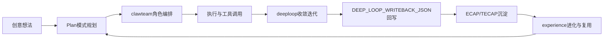
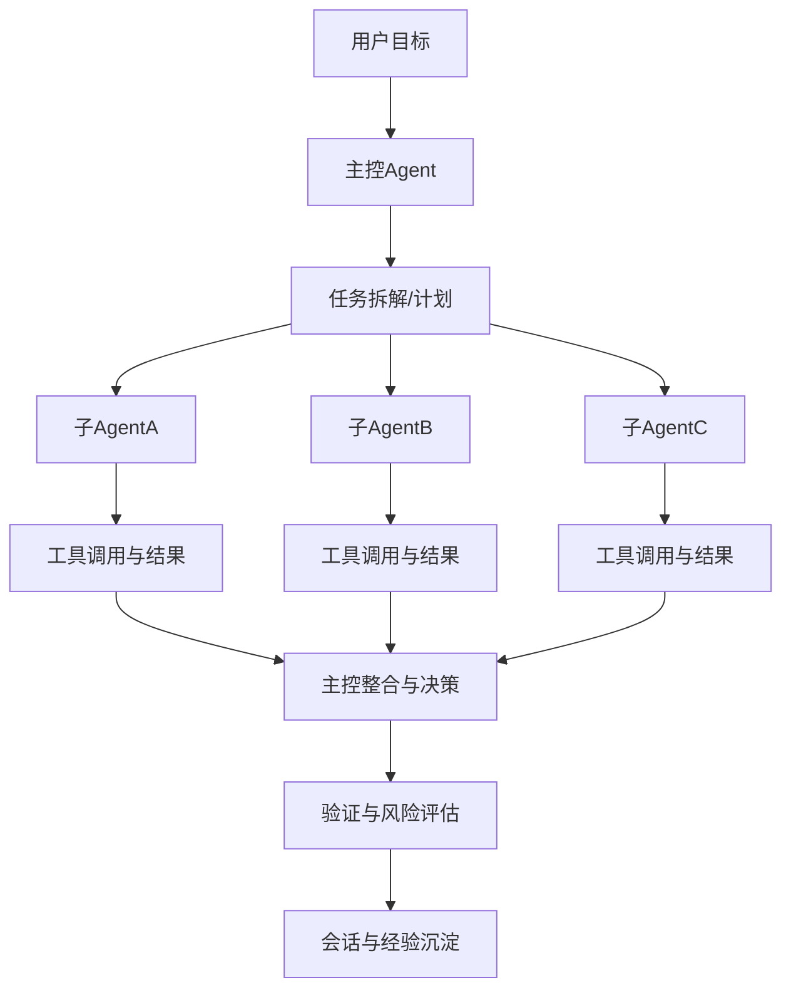

# ClawCode

**创意开发工具 / AI 编程瑞士军刀（Terminal-Native）**  

把「想法 -> 规划 -> 编码 -> 验证 -> 复盘 -> 经验沉淀」串成一条可执行、可学习、可进化的工程闭环。


[English](README.md) · **简体中文（本页）**

---

## 目录

- [ClawCode 是什么](#clawcode-是什么)
- [产品构思 / 初衷](#产品构思--初衷)
- [核心价值卡（10 秒读懂）](#核心价值卡10-秒读懂)
- [适合谁 / 现在就开始](#适合谁--现在就开始)
- [能力矩阵（定义-问题-价值-证据）](#能力矩阵定义-问题-价值-证据)
- [立体开发闭环（流程图）](#立体开发闭环流程图)
- [主从 Agent 执行架构（流程图）](#主从-agent-执行架构流程图)
- [与同类方案的差异](#与同类方案的差异)
- [与 Claude Code 的能力对齐（习惯迁移友好）](#与-claude-code-的能力对齐习惯迁移友好)
- [专业开发增强：Slash 命令与 Skill 体系](#专业开发增强slash-命令与-skill-体系)
- [快速开始](#快速开始)
- [配置与能力开关](#配置与能力开关)
- [分层上手路径](#分层上手路径)
- [高价值场景](#高价值场景)
- [文档索引](#文档索引)
- [近期更新（What’s New）](#近期更新whats-new)
- [Roadmap（下一步）](#roadmap下一步)
- [参与贡献](#参与贡献)
- [安全提示](#安全提示)
- [许可证](#许可证)

---

## ClawCode 是什么

如果你把 AI 编程助手当成“会写代码的聊天框”，ClawCode 不属于这一类。  
ClawCode 的定位是：**创意开发工具 + 工程执行系统**。

- 对个人开发者：它是可持续协作的终端搭档，不只回答“怎么做”，还帮助你“做完并验证”。
- 对团队：它是可治理的智能工作面，支持角色分工、策略配置、会话延续与经验回写。

你可以把它理解为一把 AI 编程瑞士军刀：既有即时执行能力，也有长期学习和自我进化能力。

---

## 产品构思 / 初衷

ClawCode 的出发点不是“再做一个聊天助手”，而是做一套真正服务开发者交付的创意开发工具。核心初衷包括：

- **让想法快速落地为可运行代码**  
  从“有个思路”到“实现并验证”，尽量压缩中间的上下文切换与工具摩擦。

- **打造不受平台与模型绑定的开源开发工具**  
  通过可配置的模型/供应商接入与开放扩展路径，避免被单一平台锁定。

- **继承优秀产品的可用性，而非重造使用习惯**  
  吸收市面成熟工具（如 Claude Code、Cursor）在交互与流程上的优点，尽可能保留开发者已有心智与操作习惯。

- **记住用户使用习惯，并在使用中持续优化**  
  通过会话持久化、经验回写与闭环学习机制，让系统随任务与团队实践不断进化。

- **具备扩展执行“立体开发任务”的能力**  
  不局限于单点代码生成，支持规划、分工、执行、验证、复盘、沉淀的多维协作任务。

### 立体开发任务执行栈（Claw 框架 + 工具 + Computer Use）

“立体开发任务”不是单一代码生成动作，而是把**规划、编码、验证、评审、环境操作、经验沉淀**串成同一条可执行链路。ClawCode 在实现上可分为三层执行栈：

| 执行层 | 能力说明 | 关键组件 / 命令 | 典型任务 | 入口 |
|---|---|---|---|---|
| Claw 框架层（Agent 运行时） | 在 Claw 模式下通过 `ClawAgent` 承接多轮任务执行，保持与主 Agent 循环一致，并支持迭代预算与子任务协作约束 | `/claw`、`ClawAgent.run_claw_turn`、`run_agent / run_conversation` | 复杂任务分阶段推进、跨轮上下文保持、受控多轮执行 | `docs/CLAW_MODE.md`、`clawcode/llm/claw.py` |
| 工具编排层（工程执行） | 通过 slash 命令与工具调用完成从规划到交付的流程化执行，覆盖协作、评审、诊断、学习闭环 | `/clawteam`、`/architect`、`/tdd`、`/code-review`、`/orchestrate`、`/multi-*` | 需求分解、实现、测试、审查、收敛回写一体化推进 | `clawcode/tui/builtin_slash.py`、`docs/CLAWTEAM_SLASH_GUIDE.md` |
| Computer Use 扩展层（OS 级操作） | 在开启 `desktop.enabled` 后提供 `desktop_*` 工具，实现截图、鼠标、键盘等桌面级自动化；与 `browser_*` 场景互补 | `desktop_screenshot`、`desktop_click`、`desktop_type`、`desktop_key`、`/doctor` | 跨应用操作、桌面环境检查、GUI 辅助验证 | `docs/DESKTOP_TOOLS.md`、`docs/CLAW_MODE.md`（Desktop tools） |

> 说明：`desktop_*` 默认关闭，需显式启用并安装可选依赖（如 `pip install -e ".[desktop]"` 或等价 extras 安装方式）；建议在最小权限与可控环境下使用。

这也是 ClawCode 将“终端执行能力 + 团队编排 + 经验进化”放在同一产品框架中的原因：它希望成为长期可用、可成长的工程伙伴，而不只是短时问答工具。

---

## 核心价值卡（10 秒读懂）

| 价值维度 | 核心能力 | 对用户的直接价值 |
|---|---|---|
| 创意到落地速度 | 终端原生执行 + ReAct 工具编排 | 少切换、快推进，想法更快变成可运行结果 |
| 长程任务连续性 | 本地持久会话 + 主从 Agent + 任务分解 | 复杂任务可多轮推进，支持交接与复盘 |
| 学习进化闭环 | deeploop + Experience + ECAP/TECAP | 不是一次性成功，而是越用越“懂团队” |

---

## 适合谁 / 现在就开始

### 适合谁

- 习惯终端工作流、希望 AI 真正参与执行的个人开发者
- 需要多角色协作、可治理流程与可复盘输出的工程团队
- 关注“长期效果”而不仅是“一次答案”的项目负责人

### 现在就开始

```bash
cd clawcode
python -m venv .venv
.\.venv\Scripts\Activate.ps1
pip install -e ".[dev]"
clawcode
```

---

## 项目 —— 不止是“会写代码”

### 1) 长程项目能力：永久记忆 + 连续上下文

ClawCode 的会话与消息在本地持久化，不是一次性对话。  
这意味着你可以把复杂任务拆成多轮推进，保留决策路径和执行历史，支持交接与复盘。

**价值**：更适合真实项目的“长周期开发”，而不是只做一次性 demo。

### 2) clawteam 智能团队模式：像一个可调度的虚拟研发团队

通过 `/clawteam`，系统可针对任务自动进行角色编排与执行组织：

- 智能角色选择与任务分配
- 串行/并行流程规划
- 分角色输出与最终集成
- 支持 10+ 专业角色（产品、架构、后端、前端、QA、SRE 等）

#### clawteam 智能团队成员（角色一览）

| 角色 ID | 中文角色 | 职责与典型产出 |
| --- | --- | --- |
| `clawteam-product-manager` | 产品经理 | 需求优先级、路线图与用户价值假设；输出可交付范围与验收口径 |
| `clawteam-business-analyst` | 业务分析师 | 业务流程与规则澄清；输出需求说明、边界条件与业务验收要点 |
| `clawteam-system-architect` | 系统架构师 | 架构方案与技术选型；输出模块划分、接口与非功能需求（性能、安全等） |
| `clawteam-ui-ux-designer` | UI/UX 设计 | 交互与信息架构；输出页面/组件级体验与可用性约束 |
| `clawteam-dev-manager` | 研发经理 | 研发节奏与依赖管理；输出排期风险、资源与里程碑对齐 |
| `clawteam-team-lead` | 技术负责人 / TL | 技术决策与代码质量基线；输出分工方案、评审要点与集成策略 |
| `clawteam-rnd-backend` | 后端研发 | 服务、API 与数据层实现；输出接口契约、持久化与业务逻辑落地 |
| `clawteam-rnd-frontend` | 前端研发 | 界面与前端工程化；输出组件、状态管理与联调对接 |
| `clawteam-rnd-mobile` | 移动端研发 | 移动客户端与跨端实现；输出端侧特性与发布相关约束 |
| `clawteam-devops` | DevOps | CI/CD 与构建发布链路；输出流水线、制品与环境一致性 |
| `clawteam-qa` | 质量保证（QA） | 测试策略与质量门禁；输出用例、回归范围与缺陷分级 |
| `clawteam-sre` | 站点可靠性（SRE） | 可用性、容量与可观测性；输出 SLO、告警与运维 Runbook 要点 |
| `clawteam-project-manager` | 项目经理 | 范围、进度与干系人沟通；输出里程碑、变更控制与状态同步 |
| `clawteam-scrum-master` | Scrum Master | 迭代节奏与阻碍清除；输出站会/回顾类流程约束与协作规范 |

短别名（如 `qa`、`sre`、`product-manager`）会映射到上表对应 `clawteam-*` 角色，详见 `docs/CLAWTEAM_SLASH_GUIDE.md`。

**价值**：把“一个模型单线程回答”升级为“多角色协作解题”。

### 3) clawteam deeploop：收敛式闭环迭代

`/clawteam --deep_loop` 支持多轮收敛协作，不是“跑一轮就结束”。

- 每轮按结构化契约输出（目标、交接结果、gap 等）
- 支持自动解析 `DEEP_LOOP_WRITEBACK_JSON` 并执行回写
- 可配置收敛阈值、最大迭代、回滚策略、一致性阈值

**价值**：让复杂任务从“主观感觉完成”变成“指标驱动收敛完成”。

### 4) 闭环学习与自进化：Experience / ECAP / TECAP

ClawCode 将“经验”作为第一等公民，不只存结论，更存可迁移的经验结构：

- **Experience**：表示为目标与结果间gap的经验函数，用目标与结果间的 gap 作为改进驱动
- **ECAP**（Experience Capsule）：个人/任务级经验胶囊
- **TECAP**（Team Experience Capsule）：团队协作经验胶囊
- **instinct-experience-skill**：从规则、经验到技能的可复用构建链路

#### 技术实现映射（从概念到落地）

| 能力对象 | 技术实现要点 | 关键命令 / 接口 | 数据与存储 | 文档 |
|---|---|---|---|---|
| Experience（经验信号） | 从任务执行轨迹中提炼可复用经验信号，形成后续优化输入 | `/learn`、`/learn-orchestrate`、`/instinct-status` | 观测事件与经验相关数据写入本地 data 目录 | `docs/ECAP_v2_USER_GUIDE.md` |
| ECAP（个人/任务级经验） | `ecap-v2` 结构化 schema，包含 `solution_trace.steps`、`tool_sequence`、`outcome`、`transfer`、`governance` 等字段 | `/experience-create`、`/experience-apply`、`/experience-feedback`、`/experience-export`、`/experience-import` | `<data>/learning/experience/capsules/`、`exports/`、`feedback.jsonl` | `docs/ECAP_v2_USER_GUIDE.md` |
| TECAP（团队协作经验） | `tecap-v1 -> tecap-v2` 自动升级；新增 `team_topology`、`coordination_metrics`、`quality_gates`、`match_explain` 等团队协作字段 | `/team-experience-create`、`/team-experience-apply`、`/team-experience-export`、`/tecap-*` | 团队胶囊落盘 + 导出 JSON/Markdown（支持 `--v1-compatible`） | `docs/TECAP_v2_UPGRADE.md` |
| 闭环回写（deeploop） | deep_loop 轮次输出结构化契约，支持 `DEEP_LOOP_WRITEBACK_JSON` 解析与 finalize 回写 | `/clawteam --deep_loop`、`/clawteam-deeploop-finalize` | 会话内 pending 元数据 + LearningService 回写路径 | `docs/CLAWTEAM_SLASH_GUIDE.md` |
| 迁移与治理 | 隐私分级、脱敏、反馈分数、兼容读取与跨模型迁移提示 | `--privacy`、`--v1-compatible`、`--strategy`、`--explain` | 审计快照与导出包装元信息（如 `schema_meta`、`quality_score`） | `docs/ECAP_v2_USER_GUIDE.md`、`docs/TECAP_v2_UPGRADE.md` |

#### 闭环学习与自进化流程（实现视角）

```mermaid
flowchart LR
  taskExec[任务执行与工具观测] --> expSignal[Experience信号提取]
  expSignal --> ecapCreate[ECAP创建与结构化存储]
  ecapCreate --> ecapApply[新任务前ECAP检索与应用]
  ecapApply --> taskOutcome[任务结果与验证]
  taskOutcome --> feedback[experience_feedback回写评分]
  feedback --> evolveSkill[instinct_experience_skill演进]
  evolveSkill --> teamCollab[clawteam协作执行]
  teamCollab --> tecapCreate[TECAP创建/升级tecap_v2]
  tecapCreate --> teamApply[team_experience_apply注入协作上下文]
  teamApply --> loopGate[deep_loop收敛判断与写回]
  loopGate --> expSignal
```



**价值**：系统不是只“会做一次”，而是能在反馈中持续优化下一次。

### 5) Code Awareness：编码感知与轨迹可视化

在 TUI 中，ClawCode 支持代码感知能力（Code Awareness）：

- 读/写路径感知与行为轨迹可视化
- 对当前工作区域与文件关系有更清晰的上下文提示
- 辅助理解分层与修改影响范围

**价值**：让“AI 在做什么”更可见、更可控，而不是黑盒改代码。

### 6) 主从 Agent 架构 + Plan/Execute 双模

- 主 Agent 负责策略与总控
- 子 Agent/Task 用于分解与执行
- 支持先 Plan 再 Execute 的稳态推进

**价值**：复杂任务能先收敛方案，再逐步落地，减少返工风险。

### 7) 生态兼容（迁移友好）+ 扩展能力

ClawCode 在工程实践上强调“迁移友好 + 长期扩展”：

- 对齐 Claude Code / Codex / OpenCode 相关工作流语义（互补定位）
- 支持复用 plugin 与 skill 体系
- 支持 MCP 能力接入
- 支持 computer-use / desktop 相关扩展（受配置与权限控制）

**价值**：先降低迁移成本，再放大独有能力；不是封闭生态，能纳入你现有工具链并持续扩展。

---

## 能力矩阵（定义-问题-价值-入口）

| 维度 | 能力定义 | 解决问题 | 用户价值 | 文档入口 |
|---|---|---|---|---|
| 个人效率 | 终端原生执行循环（TUI + CLI + 工具编排） | 聊天建议与真实执行脱节 | 在同一工作面完成“分析-修改-验证” | `README.md`、`pyproject.toml`、`clawcode -p` |
| 团队协作 | `clawteam` 智能角色编排（并行/串行） | 单模型难覆盖跨职能任务 | 多角色协作输出与统一整合 | `docs/CLAWTEAM_SLASH_GUIDE.md` |
| 长期进化 | `deeploop` 收敛 + 自动回写 | 任务结束即“遗忘”经验 | 把执行结果沉淀为可复用经验 | `docs/CLAWTEAM_SLASH_GUIDE.md`（deep_loop/回写） |
| 学习闭环 | Experience / ECAP / TECAP | 经验不可迁移、不可审阅 | 经验结构化、可迁移、可反馈优化 | `docs/ECAP_v2_USER_GUIDE.md`、`docs/TECAP_v2_UPGRADE.md` |
| 可观测性 | Code Awareness | AI 操作路径不透明 | 读写轨迹更可见、改动影响更可控 | `docs/技术架构详细说明.md`、TUI 相关模块 |
| 可扩展性 | plugin / skill / MCP / computer-use | 工具链封闭、二次开发难 | 可纳入既有生态并按场景扩展 | `docs/plugins.md`、`CLAW_MODE.md`、`pyproject.toml` extras |

---

## 立体开发闭环（流程图）



---

## 主从 Agent 执行架构（流程图）



---

## 与同类方案的差异

| 对比维度 | 常见 IDE 聊天助手 | 纯 API 脚本方案 | ClawCode |
|---|---|---|---|
| 交互主场 | IDE 面板 | 代码脚本 | **终端原生 TUI + CLI** |
| 执行深度 | 偏建议 | 可深但全自建 | **内置工具执行循环** |
| 长程连续性 | 视产品而定 | 依赖自建状态层 | **本地持久会话 + 经验回写** |
| 团队智能编排 | 弱或无 | 需自行实现 | **clawteam 角色编排与调度** |
| 闭环学习进化 | 弱或无 | 可做但成本高 | **ECAP/TECAP + deep loop** |
| 可观测与治理 | 视产品而定 | 自建 | **配置驱动 + 权限感知 + 审计友好** |
| 生态扩展 | 受厂商边界影响 | 高但重工程 | **插件/skill/MCP/computer-use 扩展路径** |

> **边界声明**：以上为能力与架构维度的对比，不包含任何“百分比领先”类性能结论；仅基于公开可验证功能与文档描述。

---

## 与 Claude Code 的能力对齐（习惯迁移友好）

为降低学习与迁移门槛，ClawCode 在关键工作流上提供“可对齐”的使用体验。
- 若偏好“成熟产品体验 + 即开即用”：Claude Code 有其优势。  
- 若需要“终端内深执行 + 团队编排 + 学习进化闭环 + 可配置扩展”：ClawCode 更强调这一能力组合。
ClawCode 的重点不是替代所有工具，而是将“能力对齐”作为迁移友好层，将“工程闭环与持续进化”作为核心价值层，补齐“长期工程执行与持续进化”这块能力版图。

| 对齐点 | 对齐说明 | 在 ClawCode 中的进一步价值 |
|---|---|---|
| Slash 命令工作流 | 支持通过 `/` 命令组织任务流程（如 `/clawteam`、`/clawteam --deep_loop`） | 从“命令触发”升级到“多角色编排 + 收敛迭代 + 回写沉淀” |
| Skill 机制 | 支持 skill 复用与能力扩展，降低已有资产迁移成本 | skill 可接入经验闭环，在项目中持续优化 |
| 终端原生交互 | 保持 TUI/CLI 的终端工作习惯与脚本化能力 | 同一工作面内完成分析、执行、验证与复盘 |
| 可扩展工具接入 | 支持 plugin / MCP / computer-use 等扩展路径 | 能按团队治理策略做渐进式能力扩展 |

---

## 专业开发增强：Slash 命令与 Skill 体系

在保持迁移友好的同时，ClawCode 进一步提供面向专业开发的内置增强能力：把常见“需要手工拼接的流程”做成可复用的 `/slash` 工作流，并通过 skill 体系沉淀团队实践。

### 1) 内置 `/slash` 命令（工程化增强）

以下能力在 ClawCode 中以内置命令形式直接可用，适合高频研发场景快速落地：

| 能力簇 | 代表命令 | 典型用途 |
|---|---|---|
| 多角色协作与收敛 | `/clawteam`、`/clawteam --deep_loop`、`/clawteam-deeploop-finalize` | 多角色编排、收敛迭代、结构化回写闭环 |
| 架构与质量门禁 | `/architect`、`/code-review`、`/security-review`、`/review` | 方案评审、改动分级审查、安全风险排查 |
| 工程执行编排 | `/orchestrate`、`/multi-plan`、`/multi-execute`、`/multi-workflow` | 规划-执行-交付的多阶段流程化推进 |
| 测试驱动研发 | `/tdd` | 按 RED->GREEN->Refactor 的约束流程推进实现 |
| 经验学习闭环（ECAP） | `/learn`、`/learn-orchestrate`、`/experience-create`、`/experience-apply` | 从近期执行中抽取经验并回注下一轮任务 |
| 团队经验闭环（TECAP） | `/team-experience-create`、`/team-experience-apply`、`/tecap-*` | 团队级经验沉淀、迁移与复用 |
| 可观测与诊断 | `/experience-dashboard`、`/closed-loop-contract`、`/instinct-status`、`/doctor`、`/diff` | 经验指标查看、配置契约核验、环境与改动诊断 |

> 说明：`/slash` 命令全集及描述可在 `clawcode/tui/builtin_slash.py` 查看，专题命令可参考 `docs/CLAWTEAM_SLASH_GUIDE.md`、`docs/ARCHITECT_SLASH_GUIDE.md`、`docs/MULTI_PLAN_SLASH_GUIDE.md`。

### 2) 集成 Skill（可复用专业能力）

ClawCode 内置一组面向真实研发任务的技能模板，可按领域复用并与插件体系协同扩展：

| Skill 类别 | 已集成示例 | 对开发交付的价值 |
|---|---|---|
| 后端与 API | `backend-patterns`、`api-design`、`django-patterns`、`springboot-patterns` | 提升接口设计与后端实现一致性，减少返工 |
| 前端与交互 | `frontend-patterns` | 统一前端实现习惯与组件设计思路 |
| 语言专项 | `python-patterns`、`golang-patterns` | 结合语言生态沉淀可复用实现范式 |
| 数据与迁移 | `database-migrations`、`clickhouse-io` | 降低数据变更风险，强化可回滚与可验证性 |
| 工程化与交付 | `docker-patterns`、`deployment-patterns`、`coding-standards` | 规范构建、发布和代码质量门禁流程 |
| 跨工具兼容 | `codex`、`opencode` | 降低多工具协同与迁移成本 |
| 规划与压缩表达 | `strategic-compact` | 帮助复杂任务形成清晰、可执行的高密度计划 |

> 技能路径参考：`clawcode/plugin/builtin_plugins/clawcode-skills/skills/`。  
> 建议用法：先用 `/clawteam` 或 `/multi-plan` 定义执行框架，再叠加领域 skill 约束输出质量与一致性。

---

## 快速开始

### 环境要求

- Python `>=3.12`
- 至少一个可用模型供应商凭据

### 安装（源码开发常用）

```bash
cd clawcode
python -m venv .venv
# Windows PowerShell
.\.venv\Scripts\Activate.ps1
pip install -e ".[dev]"
```

### 启动

```bash
clawcode
# 或
python -m clawcode
```

### 一次性提示模式

```bash
clawcode -p "用五条要点概括本仓库的架构。"
```

### JSON 输出模式

```bash
clawcode -p "概括近期变更" -f json
```

---

## 配置与能力开关

ClawCode 采用配置驱动，核心入口包括：

- `pyproject.toml`（项目元数据与依赖）
- `clawcode/config/settings.py`（运行时设置模型）

你可以按需配置：

- provider/model 选择
- `/clawteam --deep_loop` 收敛参数
- experience/ECAP/TECAP 相关行为
- desktop/computer-use 与其他扩展开关

---

## 分层上手路径

### 5 分钟体验（先跑起来）

1. 完成安装并启动 `clawcode`  
2. 用 `clawcode -p "..."` 跑一次提示模式  
3. 在 TUI 里试一次 `/clawteam <需求>`

### 30 分钟实战（形成闭环）

1. 选择一个真实小任务（修复/重构/补测）  
2. 使用 `/clawteam --deep_loop` 跑 2-3 轮收敛  
3. 检查输出中 `DEEP_LOOP_WRITEBACK_JSON` 与回写结果

### 团队接入（可复用）

1. 确认模型与配置策略（provider/model）  
2. 梳理可复用 skill/plugin，建立最小规范  
3. 将经验反馈接入 ECAP/TECAP 流程

---

## 高价值场景

- 复杂需求从 0 到 1：先规划后执行，跨多轮收敛
- 遗留系统改造：多角色协作拆解风险与落地顺序
- 团队交接：会话与经验沉淀可复盘、可迁移
- 长程研发任务：持续迭代而不丢上下文
- 自动化工程任务：CLI + 脚本化批处理

---

## 文档索引

- `/clawteam` 与 `deep_loop`：`docs/CLAWTEAM_SLASH_GUIDE.md`
- ECAP 用户侧说明：`docs/ECAP_v2_USER_GUIDE.md`
- TECAP v1->v2 升级：`docs/TECAP_v2_UPGRADE.md`
- 架构分层与模块：`docs/技术架构详细说明.md`
- 项目总体介绍：`docs/项目详细介绍.md`
- 依赖与可选能力：`pyproject.toml`（`optional-dependencies`）
- 架构总览：`docs/技术架构详细说明.md`
- 项目全景：`docs/项目详细介绍.md`
- `/clawteam` 指南：`docs/CLAWTEAM_SLASH_GUIDE.md`
- ECAP 指南：`docs/ECAP_v2_USER_GUIDE.md`
- TECAP 升级：`docs/TECAP_v2_UPGRADE.md`
- 文档索引：`docs/README.zh.md`
  
---

## 近期更新（What’s New）

- 完成 `clawteam --deep_loop` 自动回写链路与手动 finalize 兜底路径
- 增加 `clawteam_deeploop_consistency_min` 等收敛相关配置
- 补齐 deeploop 事件聚合与相关测试覆盖
- 文档补充 `clawteam_deeploop_*` 关键配置与闭环说明

---

## Roadmap（下一步）

- 更细粒度的 Code Awareness 可视化（读写轨迹与架构层映射）
- 团队级经验评估看板（team-level 指标聚合）
- slash 能力编排模板化（任务类型到流程模板的快速映射）
- 更丰富的 computer-use 安全策略与扩展接口

---

## 参与贡献

欢迎贡献代码与文档。提交 PR 前建议执行：

```bash
pytest
ruff check .
mypy .
```

涉及较大设计变更，建议先提 Issue 对齐边界与目标。

---

## 安全提示

AI 工具可能执行命令并修改文件。请在可控环境使用，审阅执行结果，并坚持最小权限原则管理凭据与能力开关。

---

## 许可证

GPL-3.0 license
