# ECAP & TECAP Learning System

ClawCode features a unique experience-based learning framework that turns development data into reusable, evolvable knowledge.

<p align="center">

</p>

## Overview

```
Idea → Memory → Plan → Code → Verify → Review → Learned Experience
```

## Key Concepts

### Experience
A function representing the gap between a goal and its outcome. The gap drives improvement.

**Dimensions**: model_experience, agent_experience, skill_experience, team_experience

### ECAP (Experience Capsule)
A personal/task-level capsule representing an evolvable triplet:
```
(Instinct, Experience, Skill)
```

### TECAP (Team Experience Capsule)
A team collaboration capsule including:
- Collaboration steps and topology
- Handoffs between roles
- Role-level ECAP triplets per team member

## Learning Flow

```mermaid
flowchart LR
  taskExec[Task execution and tool observations] --> expSignal[Experience signal extraction]
  expSignal --> ecapCreate[ECAP create and structured store]
  ecapCreate --> ecapApply[ECAP retrieve and apply before new work]
  ecapApply --> taskOutcome[Outcome and verification]
  taskOutcome --> feedback[experience_feedback scores]
  feedback --> evolveSkill[instinct_experience_skill evolution]
  evolveSkill --> teamCollab[clawteam collaboration]
  teamCollab --> tecapCreate[TECAP create or upgrade]
  tecapCreate --> teamApply[team_experience_apply context]
  teamApply --> loopGate[deep_loop convergence and write-back]
  loopGate --> expSignal
```



## Implementation

### Experience Signal Extraction

```bash
/learn                    # Learn from recent tool observations
/learn-orchestrate        # observe → evolve → import-to-skill-store
```

### ECAP Lifecycle

| Command | Purpose |
|---------|---------|
| `/experience-create` | Create ECAP from recent observations |
| `/experience-status` | List available capsules with filters |
| `/experience-export` | Export as JSON/Markdown |
| `/experience-import` | Import from file or URL |
| `/experience-apply` | Apply as one-shot prompt context |
| `/experience-feedback` | Record success/failure score |

### TECAP Lifecycle

| Command | Purpose |
|---------|---------|
| `/team-experience-create` | Create from collaborative traces |
| `/team-experience-status` | List with team/problem filters |
| `/team-experience-export` | Export as JSON/Markdown |
| `/team-experience-import` | Import from file or URL |
| `/team-experience-apply` | Apply as collaboration context |
| `/team-experience-feedback` | Record feedback score |

Short aliases: `/tecap-*` (maps to `/team-experience-*`)

### Storage Structure

```
<data>/
├── learning/
│   ├── experience/
│   │   ├── capsules/     # ECAP capsules
│   │   └── exports/      # Exported capsules
│   ├── team_experience/  # TECAP capsules
│   ├── observations/     # Raw observations
│   └── feedback.jsonl    # Feedback scores
└── ...
```

### Governance & Privacy

- **Privacy tiers**: Redaction, audit trails, feedback scores
- **Compatibility flags**: `--v1-compatible` for migration
- **Quality gates**: Capsule validation before application
- **Governance metadata**: `schema_meta`, `quality_score`, `transfer`

## Learning Path

```
Model → Agent → Team
Instinct → Experience → Skill
```

1. **Instinct**: Low-level reusable rules extracted from observations
2. **Experience**: Structured capsules with context and outcomes
3. **Skill**: Evolved skills ready for future task application

## Dashboard & Observability

```bash
/experience-dashboard              # ECAP metrics dashboard
/experience-dashboard --json       # JSON output
/experience-dashboard --no-alerts  # Without alert noise
/closed-loop-contract              # Config contract coverage
/instinct-status                   # Learned instincts by domain
/instinct-export                   # Export with filters
```
